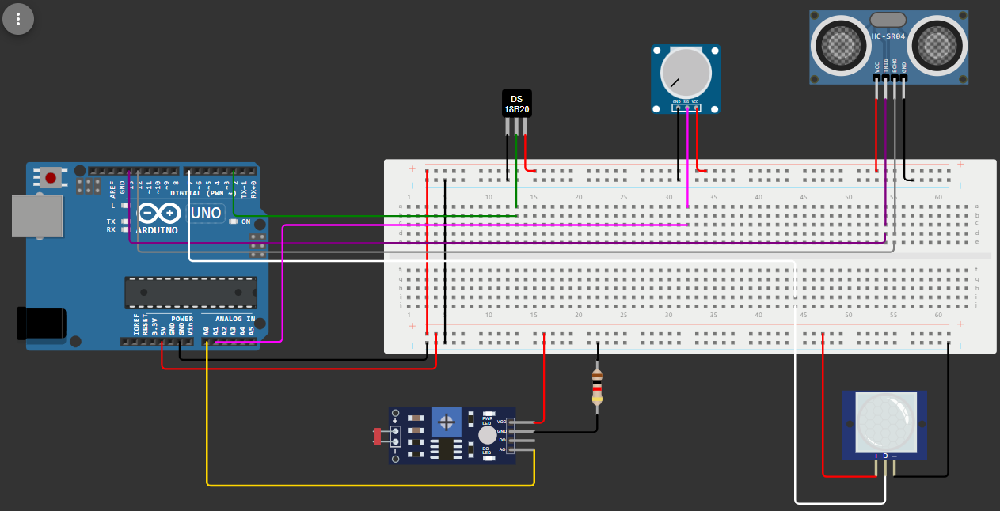

# AquaVision - GS

> A AquaVision propõe criar uma plataforma abrangente dedicada à **conservação dos oceanos**, unindo empresas, ONGs, startups e pesquisadores em uma missão em comum de proteger e revitalizar o meio marinho. A AquaVision coletará e exibirá dados sobre a qualidade da água dos oceanos, dados como a temperatura da água, a luminosidade, acidificação dos oceanos e outras variáveis ambientais. Com esses dados, os principais problemas enfrentados pelos oceanos serão identificados e apresentados, podendo assim, serem solucionados. O objetivo da AquaVision é unir projetos para o bem marinho com empresas que possam ajudar financeiramente. 

### Descrição do Projeto
> Esse projeto utiliza o Arduino e outros componentes para monitorar diversas variáveis relacionadas ao ambiente aquático. O sistema é capaz de medir a temperatura e luminosidade da água, simular a acidificação dos oceanos, determinar a profundidade do mar e capturar movimento . Com esse projeto é possível fazer uma análise abrangente das condições do mar e encontrar os principais problemas que devem ser solucionados.

### Equipamentos utilizados
* Arduino Uno;
* Protoboard;
* Jumpers;
* Sensor de temperatura (DS18B20);
* Sensor fotoresistor (LDR);
* Sensor de distância ultrassônico (HC-SR04);
* Sensor de movimento (PIR);
* Potenciômetro;
* Resistor;

### Montagem do Hardware

### Código fonte em C++
~~~ C++
// DS18B20 -> Sensor de temperatura
#include <OneWire.h> //Incluindo biblioteca
#include <DallasTemperature.h> //Incluindo biblioteca
#define DS18B20 2 //Pino do DS18B20
OneWire ourWire(DS18B20); // Configurando uma instância onewire para se comunicar com o sensor
DallasTemperature sensor(&ourWire); // Biblioteca DallasTemperature UTILIZA a OneWire

// LDR -> Sensor de luminosidade
int LDRPin = A0; // Pino do LDR
const float gama = 0.7; // Valor gama para cálculos
const float rl10 = 50;  // Valor da resistência de luz em lux (lux) a 10 lux

// HC-SR04 -> Sensor de distância ultrassônico
int HCTrig = 13; // Pino do HC
int HCEcho = 12; // Pino do HC
float profundidade; //Variável que armazenara o valor do HC

// POTENCIOMETRO -> Simulador de pH
int potenciometro = A1; // Pino do potenciômetro 
float valorPotenciometro = 0; //Variável que armazenara o valor do potenciometro

// PIR -> Sensor de movimento
const int movimento = 7; // Pino do PIR

void setup(){
  Serial.begin(9600); // Inicia a serial

  sensor.begin(); // Inicia o sensor DS18B20

  pinMode(LDRPin, INPUT); // LDR - porta de entrada 

  pinMode(potenciometro, INPUT); // Potenciometro - porta de entrada

  pinMode(HCTrig, OUTPUT); // HCTring - porta de saida

  pinMode(HCEcho, INPUT); // HCEcho - porta de entrada

  pinMode(movimento, INPUT); // PIR - porta de entrada

  delay(1000); // Intervalo de 1 segundo
}

void loop(){
  /* 
  +-----------------------+
  | TEMPERATURA (DS18B20) |
  +-----------------------+
  */
  sensor.requestTemperatures(); // Informa a temperatura do sensor
  int temperaturaAgua = sensor.getTempCByIndex(0); // Armazena a temperatura na variável

  // Mostra a temperatura
  Serial.print("Temperatura: "); 
  Serial.print(sensor.getTempCByIndex(0)); // Imprime na serial o valor de temperatura medido
  Serial.println("ºC"); 

  // TEMPERATURA IDEAL DA ÁGUA
  Serial.print("Temperatura da água: ");
  if (temperaturaAgua < 5) // Se a temperatura da água esteja abaixo de 5ºC
  {
    Serial.println("BAIXA!");
    delay(250); 
  }
  else if (temperaturaAgua < 30) // Se a temperatura da água esteja abaixo de 30ºC
  {
    Serial.println("OK!"); =
    delay(250); 
  }
  else // Se a temperatura da água esteja acima de 30ºC
  {
    Serial.println("ALTA!"); 
    delay(250); 
  } 

  // TEMPERATURA IDEAL DA ÁGUA PARA OS CORAIS
  Serial.print("Temperatura da água para os CORAIS: ");
  if (temperaturaAgua < 23)  // Se a temperatura da água esteja abaixo de 23ºC
  {
    Serial.println("BAIXA!"); 
    delay(250); 
  }
  else if (temperaturaAgua < 26) // Se a temperatura da água esteja abaixo de 26ºC
  {
    Serial.println("OK!"); 
    delay(250); 
  }
  else // Se a temperatura da água esteja acima de 26ºC
  {
    Serial.println("ALTA!"); 
    delay(250); 
  } 
  

  /* 
  +--------------+
  | PROFUNDIDADE |
  +--------------+
  */
  digitalWrite(HCTrig, LOW); // HCTring - pino LOW
  delay(0005); // Tempo de 5 milissegundos
  digitalWrite(HCTrig, HIGH); // HCTring - pino HIGH
  delay(0010); // Tempo de 10 milissegundos
  digitalWrite(HCTrig, LOW); // HCTring - pino LOW

  profundidade = pulseIn(HCEcho,HIGH); // Mede a duração do pulso de retorno do sensor quando ele detecta o eco do sinal enviado.
  // O valor retornado é o tempo em microssegundos que leva para o pulso ser detectado
  profundidade = profundidade/58; // Converte o tempo medido em microssegundos para a distância em centímetros

  // Como a unidade de medida do HC é em cm e o máximo é 400 = 4m. Consideraremos que 1cm = 1m 

  // Mostra a profundidade em metros
  Serial.print("Profundidade: ");
  Serial.print(profundidade);
  Serial.println(" m");

  /* 
  +--------------------+
  | LUMINOSIDADE (LDR) |
  +--------------------+
  */
 
  int LDR = analogRead(LDRPin); // Lê o LDR
  float tensao = LDR / 1024.0 * 5;  // Calcula a tensão com base na leitura do LDR
  float resistencia = 2000 * tensao / (1 - tensao / 5);  // Calcula a resistência do LDR
  float LDRBrilho = pow(rl10 * 1e3 * pow(10, gama) / resistencia, (1 / gama));  // Calcula a luminosidade em lux

  // Mostra o valor da luminosidade em lux
  Serial.print("Luminosidade(lux): ");
  Serial.println(LDRBrilho); 

  // CORAIS DE ÁGUAS RASAS
  if (profundidade < 30) // Se a profundidade for menor que 30 metros 
  {
    Serial.print("Corais de águas RASAS: ");  
    if (LDRBrilho < 2000) // Se o brilho for menor que 2000 lux
    {
      Serial.println("luminosidade BAIXA!");
      delay(250); 
    }
    else if (LDRBrilho < 5500) // Se o brilho for menor que 5500 lux
    {
      Serial.println("luminosidade OK!");
      delay(250);
    }
    else // Se o brilho for maior que 5500 lux
    {
      Serial.println("luminosidade ALTA!");
      delay(250); 
    }
  }
  // CORAIS DE ÁGUAS PROFUNDAS
  else // Se a profundidade for maior que 30 metros 
  {
    Serial.print("Corais de águas PROFUNDAS: ");
    if (LDRBrilho < 5500) // Se o brilho for menor que 5500 lux
    {
      Serial.println("luminosidade BAIXA!"); 
      delay(250); 
    }
    else if (LDRBrilho < 13200) // Se o brilho for menor que 13200 lux
    {
      Serial.println("luminosidade OK!");
      delay(250); 
    }
    else // Se o brilho for maior que 13200 lux
    {
      Serial.println("luminosidade ALTA!");
      delay(250); 
    }
  }

  /* 
  +------------------------------+
  | POTENCIOMETRO (Leitor de pH) |
  +------------------------------+
  */

  valorPotenciometro = map(analogRead(potenciometro),0,1023,0,14); // Lê o valor do potenciômetro e o mapeia de um intervalo de 0 a 1023 para um novo intervalo de 0 a 14

  // Mostra o pH
  Serial.print("pH: ");
  Serial.print(valorPotenciometro);

  if (valorPotenciometro < 7) // Se o valor do potenciômetro for menor que 7
  {
    Serial.println(" (ácido)");
  }
  else if (valorPotenciometro == 7) // Se o valor do potenciômetro for igual 7
  {
    Serial.println(" (neutro)");
  }
  else // Se o valor do potenciômetro for maior que 7
  {
    Serial.println(" (básico)");
  }

  /* 
  +-----------------+
  | MOVIMENTO (PIN) |
  +-----------------+
  */

  byte movimento = digitalRead(movimento); // Lê o pino da variável movimento e transforma em tipo byte.
  // O estado pode ser HIGH(1) ou LOW(0)
  if (movimento) // Se for HIGH (1)
  {
    Serial.println("Movimento captado!");
  }
  else
  {
    Serial.println("Nenhum movimento captado!");
  }
  
  Serial.println(" ");
}
~~~

### Ambiente
> O sistema de monitoramento deve ser posicionado em um local adequado que queremos monitorar, como em algum ponto do mar ou em um ponto específico da costa.

### Dados importantes
>* Temperatura ideal para a água: 5ºC a 30ºC
>* Temperatura ideal para os corais: 23°C e 26°C
>* Luminosidade ideal para os corais: 
>   * Corais de águas RASAS (menos de 30m de profundidade):  2000 lux a 5500 lux
>   * Corais de águas PROFUNDAS (mais de 30m de profundidade): 5500 lux - 13200 lux 
> * pH: 
>   * 0 - 6 ⇒ ácido
>   * 7 ⇒ neutro
>   * 8 - 14 ⇒ básico

### Resultados
> Após o sistema ser implementado e posicionado em um local que queremos monitorar. Deve ser apresentado as seguintes informações:

* Temperatura: xxºC
* Temperatura da água: baixa/ok/alta
* Temperatura da água para os corais: baixa/ok/alta
* Profundidade: xx m
* Luminosidade(lux): xxx
    * Corais de águas rasas: luminosidade baixa/ok/alta
    * Corais de águas profundas: luminosidade baixa/ok/alta
* pH: xx.xx (ácido/neutro/básico)
* Movimento captado/Nenhum movimento captado

#### Exemplo: 

### Observações
>Essa é apenas uma simulação. O projeto principal utilizaria um eletrodo de pH para medir o pH da água corretamente, porém como não há esse componente na biblioteca do simulador utilizamos um potenciômetro. Além disso, o projeto inicial contava com a aplicação de um microfone à prova d’água ou com alguma proteção para captar os sons dos animais marinhos, porém na simulação utilizamos o sensor PIR que capta movimentação apenas para mostrar a nossa ideia, o ideal seria utilizar um sensor de som como o Ky-037.

## Objetivos 
>Com esse projeto esperamos, além de obter os dados sobre as condições ambientais, compreender melhor o estado atual dos ecossistemas marinhos e  identificarmos os problemas que os oceanos enfrentam. Ademais, a análise desses dados pode nos fornecer uma compreensão mais profunda ou inesperada sobre as tendências de mudanças climáticas, impactos das atividades humanas e a saúde dos ecossistemas aquáticos. Com uma compreensão melhor desses aspectos as empresas, startups e  ONG’s podem criem soluções eficazes para contribuir com a preservação dos oceanos e a vida marinha

# Links
#### [Simulação do projeto](https://wokwi.com/projects/399335503838339073)

#### [Vídeo explicativo do projeto](https://drive.google.com/file/d/1NxBu7xgCrZG64Ffi1wBnIgYfqvZukCJg/view?usp=sharing)

#### [Código Fonte em C++](https://github.com/Nicoli-Kassa/GS_EDGE/blob/main/codigoFonte.c%2B%2B)
